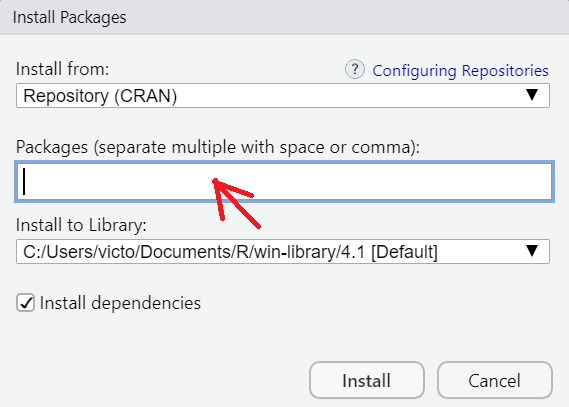
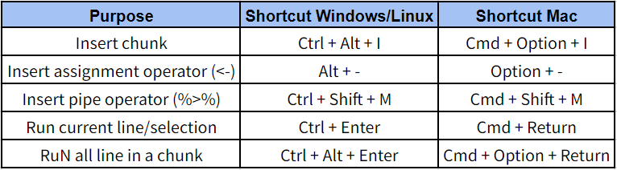
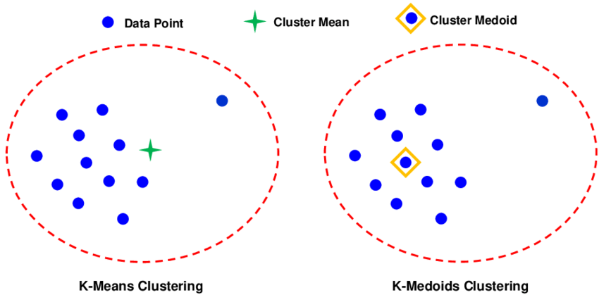
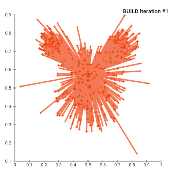

<style>
body {
text-align: justify}
</style>

```{r}
# clear-up the environment
rm(list = ls())

# chunk options
knitr::opts_chunk$set(
  message = FALSE,
  warning = FALSE,
  fig.align = "center",
  comment = "#>"
)

# scientific notation
options(scipen = 9999)
```

# Pendahuluan

Materi ini diproduksi oleh tim dari Algoritma untuk *DSS - Customer Segmentation Using PAM Algorithm*. Materi berikut hanya ditujukan untuk kalangan terbatas, meliputi individu/personal yang menerima materi ini secara langsung dari lembaga pelatihan. Materi ini dilarang untuk direproduksi, didistribusikan, diterjemahkan, atau diadaptasikan dalam bentuk apapun di luar izin dari individu dan organisasi yang berkepentingan.

**Algoritma** adalah pusat pendidikan Data Science di Jakarta. Kami mengadakan workshop dan program pelatihan untuk membantu para profesional dan pelajar untuk mendapatkan keahlian dalam berbagai bidang dalam ruang lingkup Data Science: data visualization, machine learning, data modeling, statistical inference, dan lain-lainnya.

Sebelum masuk ke dalam materi dan menjalankan kode-kode di dalam materi ini, silakan anda melihat bagian **Library and Setup** untuk melihat dan memastikan semua persyaratan dasar untuk mengikuti materi ini sudah terpenuhi termasuk package-package yang diperlukan. Pada bagian **Tujuan Pembelajaran** anda dapat melihat secara umum apa saja yang akan dipelajari dalam modul materi ini. Kami harap materi ini akan bermanfaat bagi karir ataupun menambah keahlian peserta.

## Apa itu Clustering?

Clustering adalah salah satu teknik Machine Learning, yang memiliki kemampuan untuk *mengelompokkan kumpulan data yang tidak berlabel*. Setiap data yang tidak berlabel nantinya akan diklasifikasikan ke dalam kelompok tertentu dimana, titik data yang berada dalam kelompok yang sama akan memiliki sifat atau fitur yang serupa, sedangkan titik data dalam kelompok yang berbeda diharapkan memiliki sifat atau fitur yang sangat berbeda.

Dalam ilmu data, kita dapat menggunakan clustering untuk mendapatkan beberapa wawasan berharga dari data kita dengan melihat hasil pengelompokan yang terjadi. Informasi yang berharga tersebut bisa kita bawa untuk membantu kita dalam menentukan *segmentasi market, social netwrok analysis*, dan masih banyak lagi. Di luar semua manfaat yang bisa kita dapatkan dari metode clustering, masih ada sebuah stigma yang menempel terhadap metode clustering. Pada artikel ini nantinya akan membahas metode clustering yang dapat digunakan untuk mengatasi stigma yang menempel terhadap metode clustering.

## Stigma 

Stigma yang menempel pada clustering adalah hanya bisa digunakan untuk data-data numerik. Hal tersebut terjadi karena banyak sekali implementasi atau contoh dari clustering yang hanya menggunakan data numerik.

Sesungguhnya clustering juga bisa digunakan terhadap data-data kategorikal, dan pada kesempatan kali ini kita akan mencoba menggunakan clustering untuk mengelompokan data kategorikal dan data numerik. Tipe algoritma yang akan kita gunakan nantinya bernama *Partitioning Around Medoids* dan metode perhitungan jarak yang akan digunakan adalah *Gower Distance*.

## Tujuan Pembelajaran

Tujuan utama dari workshop ini adalah untuk memberikan pengenalan yang komprehensif mengenai tools dan perangkat lunak yang digunakan untuk melakukan sekementasi kustomer dengan clustering, yakni sebuah open-source populer: R. Adapun materi ini akan mencakup:

- Dasar Bahasa Pemograman R
  * Perkenalan ke bahasa R
  * Perkenalan ke software RStudio 
  * Pemprosesan data dan manipulasi data dengan R tidyverse
- Pendahuluan ke Unsupervised Machine Learning
  * Perbedaan antara Supervised dan Unsupervised 
  * Pengelompokan dengan metode clustering
- Kasus Bisnis: Segmentasi Kustomer Supermarket
  * Perisapan data 
  * Eksplorasi data
  * Segmentasi Kustomer
    + Perhitungan jarak dengan Gower Distance
    + Menentukan jumlah cluster yang paling optimum
    + Clustering dengan PAM
    + Interpretasi hasil Clustering
    
# Dasar Bahasa Pemograman R

Sebelum itu mari kita coba berkenalan dengan R Studio UI, dengan melihat gambar di bawah ini.

## Perkenalan ke bahasa R

R merupakan bahasa pemrograman di mana seperangkat instruksi akan diterjemahkan ke dalam bahasa komputer, sedangkan RStudio merupakan aplikasi tambahan yang dapat membantu pengguna R melakukan pekerjaannya.

### Mengapa mempelajari R?

**1. Dibangun oleh ahli statistik, untuk ahli statistik.**

R adalah bahasa pemrograman statistik yang dibuat oleh Ross Ihaka dan Robert Gentleman di Departemen Statistik, di University of Auckland (Selandia Baru). R dibuat untuk analisis data, dan dengan demikian, berbeda dari bahasa pemrograman tradisional. R bukan hanya bahasa pemrograman statistik, R juga environment yang lengkap untuk analis data dan perangkat lunak analisis data yang paling banyak digunakan saat ini.

**2. Memiliki banyak Library**

R menyediakan banyak packages tambahan yang menambahkan fungsionalitas out-of-the-box untuk berbagai kegunaan: uji statistik, analisis deret waktu, visualisasi yang indah, dan berbagai tugas machine learning seperti algoritme regresi, algoritme klasifikasi, dan algoritme clustering. Komunitas R terkenal karena kontribusinya yang aktif dalam hal packages.

**3. Sumber Terbuka**

Bagian dari alasan komunitasnya yang aktif dan berkembang pesat adalah sifat sumber terbuka (open-source) dari R. Pengguna dapat berkontribusi dalam pembuatan packages, banyak tools statistik dan template kustomisasi untuk visualisasi yang tidak ditemukan dalam aplikasi statistik lain.

**4. Digunakan oleh berbagai perusahaan perangkat lunak Terbesar di Dunia**

R digunakan oleh Google untuk menghitung Return on Investment (ROI) dari berbagai iklan, dan seringkali digunakan untuk mengestimasi *casual effect*; seperti estimasi dampak dari sebuah fitur dari suatu aplikasi terhadap jumlah *download* dari aplikasi tersebut, ataupun peningkatan tingkat penjualan setelah mengeluarkan *AdWords*. Bahkan, Google merilis package R yang dapat digunakan oleh pengguna R lain untuk melakukan analisis serupa (lihat `CausalImpact`). Banyak pegawai di Google telah berkontribusi aktif terhadap komunitas pengguna R: mereka seringkali aktif dalam berbagai grup pengguna R; membuat interface untuk Google Prediction; membuat coding style versi Google untuk R, dan telah berkontribusi berbagai package untuk R.

Microsoft juga termasuk sebagai salah satu diantara perusahaan besar yang sangat bergantung pada R. Pada awalnya, Microsoft menggunakan R dalam: platform Azure–tepatnya sebagai *capacity planning*; sistem *matchmaking* pada Xbox’s TrueSkill; analisis *churn* untuk berbagai produk; dan beberapa internal services lain dalam Microsoft’s line of products. Langkah penting yang diambil oleh Microsoft dalam hal ini adalah akuisisi dari *Revolution Analytics*, yang terkenal atas berbagai produk perkembangan di R; yang sekarang lebih dikenal sebagai *Microsoft R Server, Microsoft R Open, Microsoft Data Science Virtual Machine, dll.*

**Ready for Big Data**

R dapat terintegrasi dengan tools lain dalam pengolahan big data, library seperti RHadoop, ParallelR, merupakan sebagian dari library yang mampu membantu data engineers untuk melakukan komputasi pararel di R.

## Perkenalan ke R Studio

```{r}
# Pada R Studio kita juga bisa memasukan gambar dengan menggunakan code di bawah ini
knitr::include_graphics("assets/RStudio_UI.PNG")
```

Terdapat 4 panel utama yang harus Anda pahami yaitu :

**1. Panel Source** : Panel ini merupakan fitur utama dari RStudio, panel ini menampilkan file yang sedang dibuka pada RStudio.

**2. Panel Console** : Panel ini menampilkan console asli dari R yang digunakan untuk berkomunikasi dengan R session. Terdapat beberapa tab lain seperti Terminal yang dapat digunakan untuk mengakses komputer Anda melalui Command Line Interface (CLI).

**3. Panel Environment / History** : Bagian ini menampilkan seluruh object R yang sudah dibuat selama session yang sama. Terdapat tab History yang berfungsi untuk melihat history dari kode yang sudah dijalankan sebelumnya.

**4. Panel Files/Plot/Packages/Help** :

- Tab Files : Daftar dari berkas (file) yang berada dalam working directory.
- Tab Plot : Menampilkan visualisasi yang terbentuk
- Tab Packages : Berisi daftar packages yang sudah terinstall
- Tab Help : Menampilkan dokumentasi resmi dari setiap fungsi

## Library/Packages Preparation

Library/Package adalah sekumpulan fungsi yang digunakan untuk pengolahan data tertentu. Untuk menggunakan fungsi-fungsi pada suatu package, harus dilakukan instalasi package ke komputer terlebih dahulu.

Untuk menginstal packages, klik tab panel **Packages** pada bagian kanan bawah RStudio, kemudian klik tombol **install**. Masukan list package berikut ke dalam kolom package yang ingin di-instal (ragam package yang digunakan pada Trial Class). Untuk mendapatkan ilustrasi yang lebih jelas bisa melihat gambar di bawah ini.

```{r}
knitr::include_graphics("assets/packages_installation.PNG")
```

Nantinya setelah klik tombol install akan muncul sebuah pop-up baru. Dari pop-up tersebut, kita dapat mengisi library apa saja yang ingin kita isntall pada bagian **Packages**. Untuk mendapatkan ilustrasi yang lebih jelas bisa melihat gambar di bawah ini.

```{r}

```

Berikut adalah library yang akan kita gunakan dalam melakukan membangun segmentasi kustomer.

- Library untuk periapan dan eksplorasi data: `tidyverse` & `Hmisc`
- Library untuk clustering: `cluster` & `factorextra`

Setelah berhasil melakukan instalasi library yang kita butuhkan, kita harus memanggil library tersebut terlebih dahulu. Untuk memanggil library tersebut kita akan menggunakan fungsi `library()`.

```{r}
library(tidyverse)
```

## Laporan R Markdown

Pada materi ini, kita akan menggunakan file Rmarkdown (.Rmd). Rmarkdown merupakan package/tools yang digunakan untuk membuat report dengan kualitas tinggi. Pada folder materi ini terdapat file dengan ekstensi *.html* yang merupakan hasil knit dari Rmarkdown.

Untuk melakukan transformasi R Markdown menjadi format yang kita inginkan, kita bisa mengklik tombol **knit** dan memilih format file yang di-inginkan. Untuk ilustrasi yang lebih jelas, bisa melihat gambar di bawah ini.

```{r echo=FALSE, out.width="90%"}
knitr::include_graphics(path = "assets/knit.png")
```

## Shortcut

Terdapat beberapa key shortcut yang akan memudahkan anda dalam menggunaan R. Beberapa diantaranya yaitu:

```{r}

```

## Pemprosesan data dan manipulasi data dengan R tidyverse

### Membaca data

Kita akan menganalisis data `retail.csv` yang terdapat pada folder `data`. Gunakan fungsi `read.csv()` untuk membaca file CSV ke R, lalu simpanlah ke sebuah object dengan nama `retail`. 

```{r}

```

Deskripsi kolom:

- `Row.ID` = Nomer baris
- `Order.ID` = Unique ID pemesanan
- `Order.Date` = Tanggal pemesanan
- `Ship.Date` = Tanggal pengiriman barang
- `Ship.Mode` = Jenis pengiriman yang dipilih customer
- `Customer.ID` = Unique ID customer
- `Segment` = Segmentasi/kategori custoemr
- `Product.ID` = Unique ID barang
- `Category` = Kateogri barang
- `Sub.Category` = Sub Kategori barang
- `Product.Name` = Nama produk barang
- `Sales` = Total sales dari barang yang dibeli oleh customer
- `Quantity` = Total barang yang dibeli oleh customer
- `Discount` = Total diskon yang diberikan kepada customer
- `Profit` = Total keuntungan yang didapatkan oleh perusahaan

Daripada melihat keseluruhan data, lebih baik kita "mengintip" sebagian baris yang dapat merepresentasikan bentuk keseluruhan data.

Fungsi `head()` untuk melihat beberapa baris teratas pada data (default 6)

```{r}

```

Fungsi `tail()` untuk melihat beberapa data terakhir.

```{r}

```

### Tipe data 

Setelah berhasil memanggil data yang akan diolah, kita harus memerika tipe datanya terlebih dahulu. Tujuannya agar data tersebut bisa diolah lebih lanjut. Untuk menglihat tipe data pada data kita, kita dapat menggunakan fungsi `glimpse()`.

```{r}

```

Terdapat berbagai macam tipe data di R, berikut intuisi dari setiap tipe data tersebut.

```{r}
# character
a_char <- c("Algoritma", "Indonesia", "e-Commerce", "marketing")

# factor
a_factor <- factor(c("AB", "O", "B", "A", "B", "AB", "O"))

# numeric
a_num <- c(-1, 1, 2, 3/4, 0.5)

# integer
an_int <- c(1L, 2L)

# date
a_date <- c("24/Jan/2019", "10-12-1994")

# logical
a_log <- c(TRUE, TRUE, FALSE)
```

- Tipe data *character* : Tipe data yang berisi huruf/karakter.
- Tipe data *factor* : Factor merupakan bentuk perkembangan dari character, yang membedakan character dan factor adalah objek factor memiliki levels dan pengulangan. Digunakan untuk tipe data kategorikal.
- Tipe data *numeric*:  Tipe data berisi angka yang dapat berupa angka kontinu (ada koma/pecahan), maupun diskrit (bilangan bulat tanpa koma).
- Tipe data *integer*: Tipe data berisi angka yang berupa angka diskrit (bilangan bulat tanpa koma). Untuk memaksa numeric menjadi integer, dapat gunakan L dibelakang angka.
- Tipe data *logical*: Tipe data yang hanya berisi `TRUE` atau `FALSE`. Penulisan TRUE/FALSE dapat disingkat menjadi T/F.

Cara untuk mengetahui tipe data dari suatu objek, Anda dapat menggunakan fungsi `class()`

```{r}
class(a_char)
```

Lalu, apa yang akan terjadi jika dalam satu data memiliki beberapa tipe data yang berbeda seperti chunk dibawah ini?

```{r}
mix <- c("Algoritma", 2022, TRUE)
class(mix)
```

Bila Anda perhatikan setiap nilai pada object `mix` memiliki **petik dua**, artinya nilai tersebut merupakan sebuah objek dengan tipe character. Proses perubahan paksa dari suatu vector bisa disebut sebagai **implicit coercion**. Ilustrasi terjadinya implicit coercion dapat dilihat pada gambar di bawah ini:

```{r}
knitr::include_graphics("assets/data_type.png")
```

### Persiapan & Eksplorasi Data

Pada tahapan persiapan dan eksplorasi, kita akan memanfaatkan `library(tidyverse)` untuk memudahkan. 

- Mengubah tipe data

Persiapan yang akan kita lakukan pada data kita adalah mengubah tipe data yang belum sesuai. Untuk mengubah tipe data, kita akan menggunakan fungsi `mutate()`

Simbol `%>%` digunakan untuk menyambungkan proses yang **sequential** atau berurutan dari setiap fungsi yang kita gunakan.

```{r}

```

Untuk memastikan apakah tipe dataya sudah berhasil terubah, mari kita coba cek sekali lagi dengan menggunakan fungsi `glimpse()`

```{r}

```

- Eksplorasi Data

*Exploratory Data Analysis* bertujuan untuk mendapatkan insight dari data sesuai pertanyaan bisnis yang diajukan. Dari data retail, kita akan coba menjawab pertanyaan bisnis berikut:

Q1: Bagaimanakah performa penjualan (`Sales`) untuk setiap category (`Category`) barang yang dijual pada perusahaan retail tersebut?

Berikut adalah beberapa fungsi dari library dplyr yang akan kita gunakan untuk menjawab pertanyaan bisnis tersebut.

- `group_by()`: Fungsi ini dapat kita manfaatkan untuk mengelompokkan setiap segment barang pada data kita.
- `summarise()`: Fungsi ini dapat kita manfaatkan untuk melakukan perhitungan matematis, untuk melakukan penjumlahan hasil penjualan untuk setiap segment barang yang dimiliki.
- `arrange(desc())`: Fungsi ini dapat kita manfaatkan untuk mengurutkan nilai yang ada

```{r}

```

Q2: Berapa jumlah kustomer yang menggunakan mode pengiriman barang (`Ship.Mode`) dengan metode first class?  

- `fitler()`: Fungsi ini digunakan untuk memberikan sebuah kondisi tertentu
- `select()`: Fungsi ini digunakan untuk memilih salah satu kolom saja

```{r}

```

# Topik bisnis: Customer Segmentation

Dalam mempelajari algoritma *PAM* dan perhitungan jarak *Gower Distance*, kita akan membuat sebuah segmentasi kustomer berdasarkan data historis pengunjung hotel. Harapannya, segmentasi kustomer yang dihasilkan dapat membantu tim marketing dalam membuat promosi yang lebih tepat sasaran dan target penjualan pada tim sales dapat diraih lebih cepat dari biasanya.

## Library 

```{r}
# Data Wrangling
library(tidyverse)
library(Hmisc)

# Machine Learning - Clustering 
library(cluster)
library(factoextra)

# Visualization
library(Rtsne)
library(rgl)
library(plotly)
```

## Dataset

Data yang akan kita gunakan adalah data historikal pembelian kustomer pada sebuah toko selama 6 bulan terakhir, dari data tersebut nantinya akan coba kita kelompokan untuk membuat beberapa segmentasi kustomer.

```{r}
# Please run the code down below
cust_purchase <- read.csv("data/ifood_customer.csv")

head(cust_purchase)
```

Deskripsi kolom:

- `ID`: unique ID customer
- `Year_Birth`: Tahun kelahiran customer 
- `Education`: Pendidikan terakhir customer (Graduation, PhD, Undergraduate, Master)
- `Marital_Statuts`: Status pernikahan customer (Single, Maried, Widow)
- `Income`: Penghasilan customer dalam 1 tahun
- `Kidhome`: Jumlah anak kecil yang terdapat pada rumah customer
- `Teenhome`: Jumalah anak remaja yang terdapat pada rumah customer
- `MntWines`: Jumlah pengeluaran untuk produk wine dalam 6 bulan terakhir
- `MntFruits`: Jumlah pengeluaran untuk produk buah-buahan dalam 6 bulan terakhir
- `MntMeatProducts`: Jumlah pengeluaran untuk product daging merah dalam 6 bulan terakhir
- `MntFishProducts`: Jumlah pengeluaran untuk product ikan dalam 6 bulan terakhir
- `NumWebPurchases`: Jumlah transaksi yang dilakukan customer melalui website
- `NumCatalogPurchases`: Jumlah transaksi yang dilakukan customer melalui catalog
- `NumStorePurchases`: Jumlah transaksi yang dilakukan customer secara offline atau data ke store
- `Country`: Kebangsaan customer tersebut

## Data Wrangling

Wrangling 1: Apakah kolom income perlu kita hilangkan simbol yang terdapat pada setiap rownya, agar dapat kita olang sebagai tipe data numeric?

Jika kita harus mengubahnya maka kita coba manfaatkan fungsi `str_replace_all()`

```{r}
# Please run the code down below

```

Wrangling 2: Apakah kolom ID perlu kita buang?

Wrangling 3: Apakah terdapat kolom yang belum sesuai tipe datanya?

-
-

```{r}
# Please run the code down below

```

## Eksplorasi Data

Pada tahapan eksplorasi data, kita akan mencoba untuk lebih mengenali data yang kita miliki. 

EDA 1: Melihat apakah ada missing value

```{r}
# Please run the code down below

```

EDA 2: Melakukan 5 number summary

```{r}
# Please run the code down below

```

Insight:

-
-

Sebagai tambahan untuk data dengan tipe numerik kita bisa melakukan visualiasi dengan plot histogram untuk melihat jumlah observasinya.

```{r}
# Please run the code down below

```

Additional Insight:

- 

## Clustering

### K-Means Vs Partisioning Around Medoids

Algoritma Partitioning Around Medoids(PAM) atau bisa disebut K-Medoids adalah sebuah metode pengelompokan non-hierarki yang masih menjadi keluarga dekat dari metode K-Means. Metode PAM atau K-Medoids ini akan mengelompokan sekumpulan n objek menjadi ke beberapa k cluster. Jika metode pengelompokannya seperti itu, apa bedanya dengan metode K-Means kalau begitu? Perbedaanya terdapat pada bagaimana melakukan pengelompokannya.

Pada metode K-Means, penentuan sebuah objek masuk ke sebuah cluster tertentu berdasarkan perhitungan rata-rata jarak ecluidean. Sedangkan cara kerja metode K-Medoids akan diawali dengan penentuan Medoids (sebuah objek yang letaknya terpusat di dalam suatu cluster). Dari gambar di bawah, kita dapat melihat bagaimana perbedaan antara metode K-Means & K-Medoids dalam menentukan sebuah objek lebih sesuai untuk masuk ke sebuah cluster tertentu.

```{r, echo=F}

```

Penentuan Medoids itu tidak dilakukan hanya sekali, melainkan berulang sampai Medoids itu tidak bisa bergerak lagi. Mengapa tidak hanya sekali, dikarenakan peletakan Medoids belum tentu posisi paling optimal. Untuk mendapatkan posisi yang paling optimal nantinya posisi Medoids awal akan dihitung ulang total simpangannya dengan menggunakan rumus berikut di bawah ini.

$$
S = b - a  
$$
Dimana:   

- `a` adalah jumlah jarak terdekat antara objek ke medoid awal
- `b` adalah jumlah jarak terdekat antara objek ke medoid baru

> Jika S < 0, maka tukar obyek dengan data untuk membentuk sekumpulan k baru sebagai Medoid

Langkah tersebut akan terus diulang sampai nantinya <b>S > 0</b>, yang berarti tidak adanya pergerakan lagi dari Medoid yang dipilih sebagai titik tengah. Dari titik Medoids yang paling optimum itu, akan dicari lagi objek yang menyerupai dari karakteristik Medoids tersebut. Supaya lebih terbayang dengan cara kerja dari metode PAM, kita bisa melihat visualisasi di bawah ini.

```{r, echo=F}

```

### Implementasi Partisioning Around Medoids

Setelah berkenalan dengan data yang kita gunakan, mari kita coba implementasikan metode PAM untuk membuat segmentasi kustomer supermarket. Secara garis besar akan ada 3 langkah yang nantinya akan dilakukan, yaitu:

- Perhitungan jarak antar observasi data
- Penentuan jumlah cluster
- Pembuatan cluster

#### Perhitungan Jarak

Dari hasil eksplorasi data, kita mengetahui bahwa total observasi data kita adalah lebih dari 2.000 baris dan setiap observasi data pastinya memiliki nilai yang berbeda. Agar nantinya hasil dari setiap kelompok terdiri dari data-data yang identik, kita harus mengetahui jarak antara satu observasi dengan observasi lainnya berdekatan atau tidak

Pilihan paling populer untuk menghitung jarak adalah *Euclidean*, namun metode tersebut hanya berlaku untuk data numerik saja, oleh karena itu metode Euclidean tidak berlaku di sini. 

Rumus Euclidean: 

$$
Euclidean Distance = {\sqrt{(p - q)^2}}
$$

Dimana:

- `p`: titik observasi 1
- `q`: titik obervasi 2

Ada satu metode yang dapat kita gunakan untuk kasus yang memiliki data campuran (data numerik dan data kategorikal), metode tersebut dinamakan *Gower Distance*.

Rumurs Gower Distance:

$$
Gower Distance = 
$$

Dimana:

- ``
- ``

Metode Gower Distance nantinya akan melakukan perbandingan pada setiap observasi data yang ada terhadap data-data yang lainnya, dengan cara melakukan *perhitungan skala antara kedua observasi yang dibandingkan dengan rentan 0 sampai 1*. 

- Jika hasil dari perbandingannya mendekati 0 maka bisa dibilang kedua data tersebut identik atau jarak antara kedua observasi tersebut berdekatan
- Jika rentan perbandingannya mendekati 1 bisa dibilang kedua data tersebut tidak identik atau jarak antara kedua observasi tersebut berjauhan.

Supaya lebih terbayang bagaimana hasil dari metode Gower Distance, mari kita coba implementasikan ke data kita. Di R, metode Gower Distance tersimpan pada *library(cluster)* dan fungsi yang bisa digunakan adalah *daisy()*. Pada fungsi tersebut nantinya akan ada 2 parameter yang bisa diisi, yaitu:

- `x`: Data frame yang ingin digunakan
- `metric`: Metode apa yang ingin digunakan, karena kita akan menggunakan metode Gower Distance, kita bisa isi dengan **“gower”**.

```{r}
# Please type your code

```

Sebagai pembuktian apakah metode Gower Distance memang bisa menempatkan data-data kita berdasarkan kemiripannya, kita bisa mencetak pasangan yang paling mirip dan berbeda dalam data kita dengan menggunakan fungsi di bawah ini.

* Contoh pasangan data yang paling identik

```{r}
# Please run the code down below

```

>

* Contoh pasangan data yang paling tidak identik

```{r}
# Please run the code down below

```

>

#### Penentuan Jumlah Cluster

Seperti yang sudah disampaikan pada bagian pendahuluan, tujuan dari melakukan clustering adalah menempatkan setiap observasi data yang ada ke beberapa kelompok yang sesuai dengan karakteristiknya atau bedasarkan kedekatan jarak antar setiap observasi. Pada langkah pertama kita sudah memiliki informasi jarak antar setiap observasi, kita akan memanfaatkan informasi tersebut untuk menentukan berapakah kelompok yang paling optimal. Hasil dari jumlah kelompok nantinya akan digunakan untuk menentukan berapa banyak segmentasi kustomer

Disini kita akan menggunakan metode *Elbow Method*. Fungsi yang dapat kita gunakan adalah `fviz_nbclust()` dari `library(factoextra)`. Pada fungsi tersebut nantinya akan ada 3 parameter yang bisa diisi, yaitu:

- `x` = Data frame yang ingin digunakan
- `FUNcluster` = Metode pengelompokan apa yang ingin digunakan, karena kita akan menggunakan metode PAM, kita bisa isi dengan pam.
- `method` = Metode apa yang ingin digunakan untuk mengestimasi jumlah kelompok yang paling optimal.

##### Metode 1: Elbow Method

Dengan metode pertama ini kita akan memvariasikan jumlah kelompok dengan menghitung Within Sum of Square (WSS). WSS adalah akan menghasilkan jumlah kuadrat jarak antara setiap observasi terhadap titik Medoids untuk setiap kemungkinan jumlah kelompok. 

$$

$$

Fungsi `fviz_nbclust()` secara otomatis akan menghitung WCSS sampai dengan 10 kelompok (jumlah kelompok yang ingin dicoba hitung bisa diatur secara manual sesuai dengan kebutuhan).

Dengan bertambahnya jumlah kelompok, nilai WSS akan mulai berkurang (nilai WSS terbesar ketika K = 1). Ketika kita menganalisis grafik kita dapat melihat bahwa grafik akan berubah dengan cepat pada suatu titik dan dengan demikian menciptakan bentuk siku. Dari titik ini, grafik mulai bergerak hampir sejajar dengan sumbu X. Nilai K yang sesuai dengan titik ini adalah nilai K optimal atau jumlah kelompok yang optimal.

```{r}
# Please type your code

```

##### Metode 2: Silhouette Method

Metode kedua yang akan dicoba untuk menentukan jumlah kelompok yang optimal adalah Silhouette Method. Metode ini akan menghitung seberapa mirip sebuah observasi dengan kelompoknya sendiri jika dibandingkan dengan nilai kelompok lainnya. 

$$
Silhouette Method = \frac{b-a}{\max(a, b)}
$$

Dimana:

- `a` = Rata-rata jarak pada setiap cluster 1 terhadap nilai medoidsnya
- `b` = Rata-rata jarak terdekat terhadap cluter yang ditentukan oleh parameter a
- `max(a, b)` = Nilai maksimal yang dihasilkan dari perhitungan antara parameter a atau b

Hasil dari perhitungannya akan memiliki rentan koefisien dari -1 sampai 1. Jika nanti hasilnya makin mendekati 1 maka observasi tersebut cocok dengan kelompoknya dan kurang cocok dengan kelompok tetangga, begitu juga sebaliknya, jika hasilnya makin mendekati -1 maka observasi tersebut tidak cocok dengan kelompoknya akan tetapi lebih cocok dengan kelompok tetangganya.

Berbeda dengan elbow method, makin bertambahnya jumlah kelompok, nilai hasil perhitungan metode silhouette method tidak pasti akan berkurang. Penentuan nilai kelompok yang optimal akan ditentukan berdasarkan nilai koefisien paling tinggi pada saat membagi keseluruhan observasi ke berapa banyak kelompok.

```{r}
# Please type your code

```

##### Metode 3: Gap Statistic Method

Metode terakhir yang akan digunakan adalah Gap Statistic Method, metode ini akan menghitung seberapa berbeda total variansi antara setiap observasi pada sebuah kelompok terhadap observasi yang terdapat pada kelompok lainnya.

```{r}
# Please type your code

```

> Dislaimer: Penentuan jumlah kelompok tidak wajib menggunakan 3 metode pengujian di atas, penentuan kelompok juga dapat ditentukan berdasarkan pertanyaan bisnis atau kesepakatan bersama.

#### Pembuatan Cluster

Setelah mengetahui jumlah kelompok yang optimal, sekarang kita bisa memulai tahapan terakhir yaitu mengelompokan semua kustomer dengan menggunakan fungsi `pam()`. Pada fungsi tersebut nantinya akan ada 2 parameter yang bisa diisi, yaitu:

- `x` = Data frame yang ingin digunakan
- `k` = Jumlah kelompok

```{r}
# Please type your code

```

Fungsi di atas akan membantu kita untuk mengelompokan keseluruhan observasi data ke beberapa kelompok berdasarkan kemiripan setiap observasi terhadap titik pusat atau <i>medoids</i>. Supaya kita bisa mendapatkan intuisi awal bagaimana karakteristik setiap kustomer untuk setiap kelompoknya, kita bisa melihat dari tabel di bawah ini.

```{r}
# Please type your code

```

Seperti yang sudah disampaikan, dengan melihat tabel di atas kita hanya bisa mendapatkan intuisi awal bagaimana karakteristik dari masing-masing kelompok yang dibuat. Supaya kita dapat melakukan interpretasi lebih detail dan melihat apakah pengelompokan yang kita lakukan sudah dapat memisahkan setiap observasi data dengan baik, kita bisa memanfaatkan *metode statistik deskriptif* dan *visualisasi.*

### Interpretasi

#### Metode Visualisasi

Jika dengan menggunakan metode statistik deskriptif kita bisa memahami karakteristik dari masing-masing kelompok, metode visualisasi dapat membantu kita untuk menilai bagaimana hasil pengelompokan. Metode visualisasi yang akan digunakan adalah metode t-SNE, metode ini merupakan salah satu cara untuk memvisualisasikan data yang tidak hanya memiliki nilai numerik saja melainkan nilai kategorikal juga.

```{r}
# Please type your code

```

Dari hasil plot di atas, kita bisa melihat bahwa setiap observasi sudah berhasil terbagi menjadi beberapa kelompok walaupun memang masih ada beberapa observasi yang tumpang tindih atau berdekatan pada sebuah kelompok yang didominasi oleh kelompok yang berlawanan.

#### Metode Deskriptif

Tujuan melakukan statistik deskriptif adalah untuk memahami karakteristik masing-masing kelompok, dan dalam kasus ini untuk mengetahui karakteristik untuk setiap segmentasi kustomer.

```{r}
# Please type your code

```


**Referensi** 

1. [Clustering datasets having both numerical and categorical variables](https://towardsdatascience.com/clustering-datasets-having-both-numerical-and-categorical-variables-ed91cdca0677)
2. [K-Medoids/Partitioning Around Medoids (PAM) — Non Hierarchical Clustering with R](https://medium.com/@tribinty/k-medoids-partitioning-around-medoids-pam-non-hierarchical-clustering-with-r-9d0af590bbc0)
3. [K-Means Cluster Analysis](K-means Cluster Analysis)
4. [t-SNE](https://lvdmaaten.github.io/tsne/)


